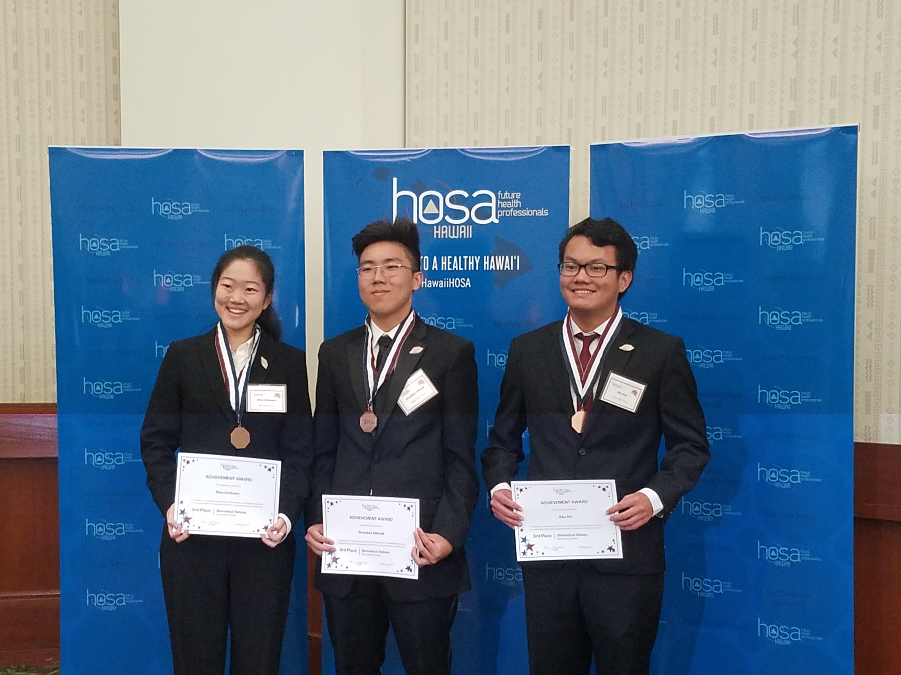

  
  

I joined the HOSA club in high school during my junior year because I was planning to become a healthcare professional in the future. Until I decided to switch majors and do Computer Science. During my time in HOSA, my team and I decided to participate in the 2018 annual competitve event for HOSA and we chose Biomedical Debate out of the many other options available to us. My team was able to come in third place which qualified us for the international event which was to be held in Dallas, Texas. Unfortunately, my team was unable to qualify for placing during our event in Dallas, Texas.

