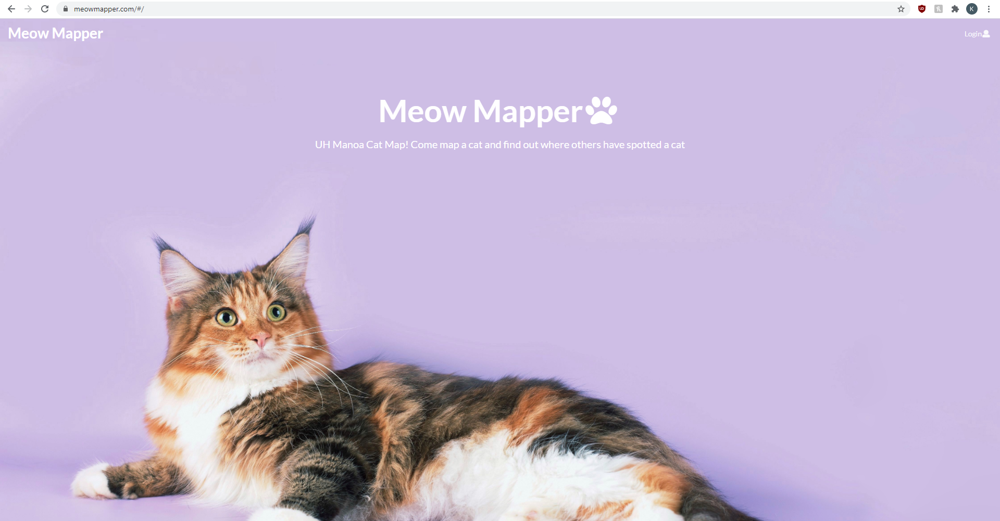
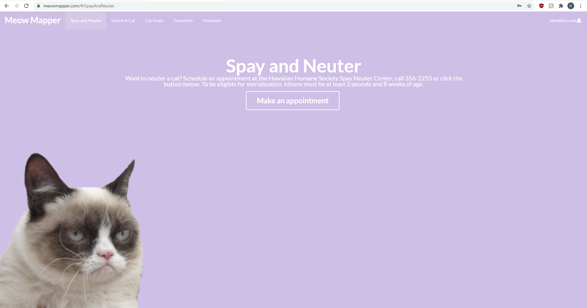
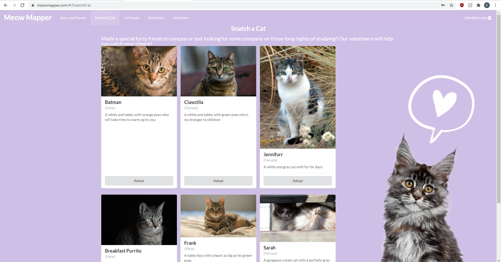
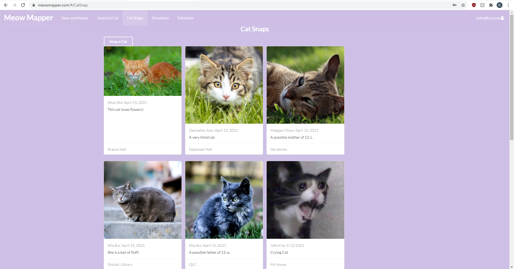
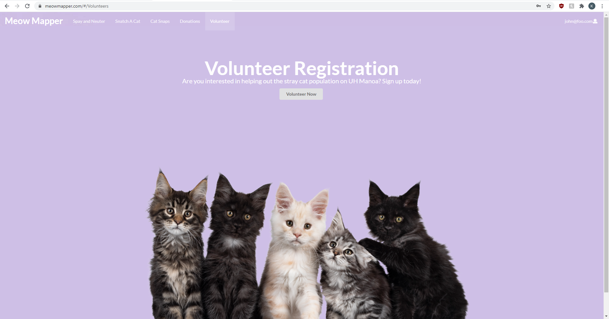
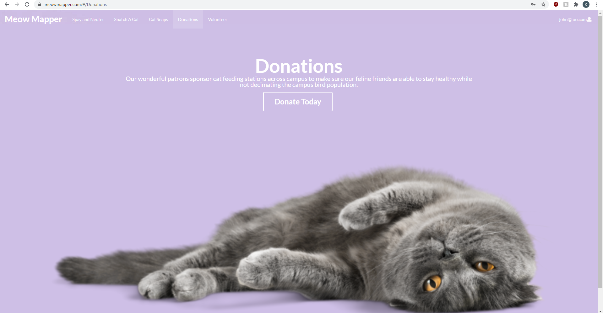

My group and I made a website as a final project for our ICS 314 class. My group consisted of Nhan Bui, Maegan Chow, Germaine Juan and myself. Our final result was Meow Mapper, which is a website that UH Manoa students can use to track the stray cats on campus. The website lets user take pictures of cats and post where they last saw the cat as well as adopt the cats. We also made a volunteer signup page for anyone who wants to volunteer their time to help take care of the cats.

The website requires you to make an account or be logged in. Once logged in, the user will have access to use the website and the functions available to them.

The Spay and Neuter page has a button that redirects the user to the Hawaiian Humane Society website to make an appointment if they want to spay or neuter a stray cat.

The Snatch a Cat page lets the user̀ see the cats that are available for adoption and when the adopt button is clicked, they will be brought to a form to fill out, which will be delivered to the admin where the admin will contact the user for further information.

The Cat Snaps page is for users to take pictures of the stray cats that they see around campus as a way to track them. The cards have a location tag on them for users who want to track down the cats.

The volunteer page has a button that brings up a form for people to fill out if they want to volunteer their time to help out the stray cats on campus.

We also made a donation page with a button that doesn't do anything because we are not really looking for donations, but if it were to work, the donations would go to buying supplies and food for the stray cats.

The website is available at <a href="https://meowmapper.com/">https://meowmapper.com/</a>. 
Our homepage for our website is located at <a href="https://meowmapper.com/">https://meow-mapper.github.io/</a>.
