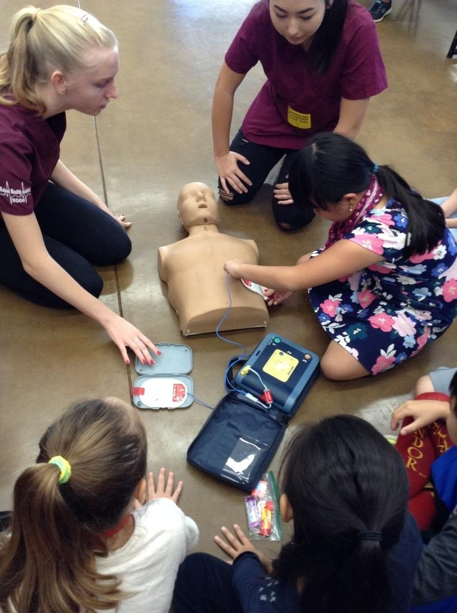
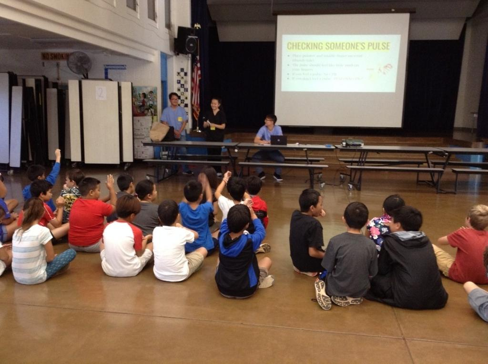

In my senior year of high school, my teacher assigned us with a community outreach project to help teach elementary school students CPR. My team decided to reach out to Hokulani Elementary to set up an event. We were able to connect with the 4th grade teachers and had all of the 4th grade students attend our event. We taught the 4th graders how to perform cpr on adult dunnies as well as the baby dummies. There were also training defibrillators to use for practice.

To set up the event we had to contact multiple people such as the Kalani High School principal because we need permission to leave campus during a school day as well as for the school bus for transportation. We also came into contact with multiple teachers of different grades to see who was willing to collaborate with us. Eventually, we were able to gain approval from all of our contacts and set up the event. We also had some volunteers from some underclassmen who volunteered for the event.
