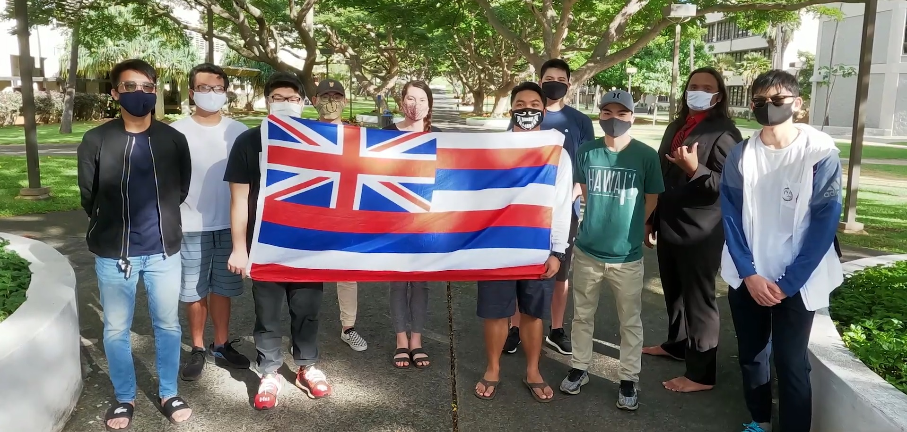

  

I recently joined the UH Esports program and they recently just started up a Rainbow Six Siege team. I enjoy playing Rainbow Six Siege during my free time and so I wanted so see what it would be like to play at a higher level. Playing Siege in a competitive setting is completely different from playing in a casual setting. Everyone on the team needs to have good communication and decision making skills in order to work together cohesively as a team. Since I am also the in-game leader I have to make the important calls on what to do and how it should be done as well as prep my team for matches.
